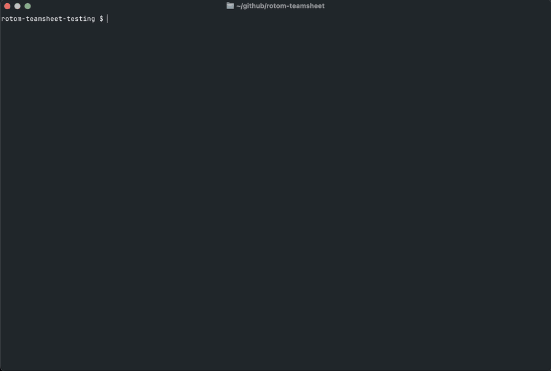

```
                      @@@@@@@@@@@@@@@@@@@@@@@@@@@@@@@@@@@@@@@@@@@@@@@@@@@@@@@@@@@
                        R   O   T   O   M  -  T   E   A   M   S   H   E   E   T @
                      @@@@@@@@@@@@@@@@,:,@@@@@@@@@@@@@@@@@@@@@@@@@@@@@@@@@@@@@@@@
                      @@@@@@@@@@@@@@@@,::,@@@@@@@@@@@@@@@@@@@@@@@@@@@@@@@@@@@@@@@
                      @@@@@@@@@@@@@@@@,:**:,@@@@@@@@@@@@@@@@@@@@@@@@@@@@@@@@@@@@@
                      @@@@@@@@@@@@@@@@@:***:,@@@@@@@@@@@@@@@@@@@@@@@@@@@@@@@@@@@@
                      @@@@@@@@@@@@@@@@@,:...::@@@@@@@@@@@@@@@@@@@@@@@@@@@@@@@@@@@
                      @@@@@@@@@@@@@@@@@,:.+..*:,@@@@@@@@@@@@@@@@@@@@@@@@@@@@@@@@@
                      @@@@@@@@@@@@@@@@@,*.++..*:,,@@@@@@@@@@@@@@@@@@@@@@@@@@@@@@@
                      @@@@@@@@@@@@@@@@@@:*.+...***::,,@@@@@@@@@@@@@@@@@@@@@@@@@@@
                      @@@@@@@@@@@@@@@@,::*.***......**:,@@@@@@@@@@@@@@@@@@@@@@@@@
                      @@@@@@@@@@@@@@@,:*..***.......+S*:,@@@@@@@@@@@@@@@@@@@@@@@@
                      @@@@@@@@@@@@@@@:**..*..SS......+.*,@@@@@@@@@@@@@@@@@@@@@@@@
                      @@@@@@@@@@@@@@@:*...+++.+.+++++..*,@@@@@@@@@@@@@@@@@@@@@@@@
                      @@@@@@@@@@@@@@@,**.+++++++++++..**:,,,,,,,@@@@@@@@@@@@@@@@@
                      @@@@@@@@@@@@@@@@,**...++++++..*:,,,,::::,,,,,,,,,@@@@@@@@@@
                      @@@@@@@@@@@@@@,,:::::***...+.**:@@@@@,,,,::,,::,,@@@@@@@@@@
                      @@@@@@@@@@@@,,:::,@@@,**.....*:,@@@@@@@,::*:,,@@@@@@@@@@@@@
                      @@@@@@@@@@,,,::,@@@@@@,,:****:@@@@@@@,::,,:::,,,@@@@@@@@@@@
                      @@@@@@@@,::::,@@@@@@@@@@@,:::,@@@@,:::,@@@@@,,,:,,,,@@@@@@@
                      @@@@@@:***:*:::::::::,@@@@@,:,@@,:*::,,,,,,@@@@,,,,,,,,,@@@
                      @@@@:***:,@@@@@@,:*:,@@@@@@@,,@@@,,,,,,,::,,:,,,,,,,,,:::,,
                      @@@@,,,:*:,@@@,:::,@@@@@@@@@@@@@@@@@@@@@@@@@@@@@@@@@,,,,,,,
                      @@@@@@@::,@@,::,@@@@@@@@@@@@@@@@@@@@@@@@@@@@@@@@@@@@@@@@@@@
                      @@@@@,::,@,::,@@@@@@@@@@@@@@@@@@@@@@@@@@@@@@@@@@@@@@@@@@@@@
                      @@@@,:,,::,,@@@@@@@@@@@@@@@@@@@@@@@@@@@@@@@@@@@@@@@@@@@@@@@
                      @@,,,,,,,@@@@@@@@@@@@@@@@@@@@@@@@@@@@@@@@@@@@@@@@@@@@@@@@@@
                      @,:,,,,@@@@@@@@@@@@@@@@@@@@@@@@@@@@@@@@@@@@@@@@@@@@@@@@@@@@
                      ,::,,@@@@@@@@@@@@@@@@@@@@@@@@@@@@@@@@@@@@@@@@@@@@@@@@@@@@@@
                      ,:,@@@@@@@@@@@@@@@@@@@@@@@@@@@@@@@@@@@@@@@@@@@@@@@@@@@@@@@@
```

# Introduction
Rotom-Teamsheet is a Node application that converts Poke Pastes (pokepaste.es) containing statistics of Pokemon teams into a teamsheet for use at Pokemon VGC ("Video Game Competition") Local events.

To generate a valid teamsheet, follow the instructions below, enter the required information when prompted. A PDF will be generated with your teamsheet at the directory in which Rotom-Teamsheet was run.

# Requirements
- A recent version of [NodeJS](https://nodejs.org/en).
- A Poke Paste (pokepaste.es, or other site with an identical API) link disclosing Pokemon EV spreads/moves/alignment.
- Live internet connection, for fetching the paste, and pokemon stat spreads. Only Pokemon data is fetched using the internet. The other input manually entered into the program (e.g., trainer name, trainer details) stays on your local machine.

Understandably, the Poke Paste will not work if it does not include EV spreads. The program will not infer/divine/guess
at EV spreads for you. :smile:

# Installation
- `pnpm install`
- `pnpm build`

# Running
- `pnpm run app`



[Generated PDF](examples/example-generated-teamsheet.pdf)
(Data entered is not real player data.)

# Supported Platforms
- Tested and working on OSX; presumed to work on Linux.

# Issues and Contributions
If you are experiencing an issue with the application, you are welcome to open an issue.

At this stage of project development, please do not submit direct proposals/contributions. It is anticipated that I will be rewriting this in a strongly typed language so that binaries can be generated without resort to a Node SEA implementation.

# Thank-Yous
Thanks to [Vanessa Sochat's Pokemon repository](https://github.com/vsoch/pokemon) for the Rotom ASCII-Art!
